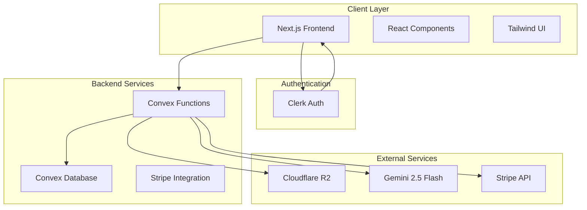

# Design Document

## Overview

RoomsThatSell's virtual staging MVP is a Next.js application that provides real estate agents with AI-powered virtual staging capabilities. The system uses a modern tech stack with Convex for real-time data management, Clerk for authentication, Cloudflare R2 for image storage, and Google's Gemini 2.5 Flash Image model for AI staging processing.

The architecture follows a project-based workflow where agents organize listings into projects, upload room photos, apply AI staging with style consistency, and export MLS-compliant results. The system prioritizes user experience, reliability, and compliance with real estate industry standards.

## Architecture

### High-Level Architecture



### System Flow

1. **Authentication Flow**: Users authenticate via Clerk, with optional Stripe payment for plan selection
2. **Project Management**: Users create projects for individual listings with metadata
3. **Image Upload**: Batch upload to Cloudflare R2 with intelligent room type detection
4. **AI Processing**: Gemini 2.5 Flash processes images with style consistency
5. **Review & Export**: Users review results in gallery/kanban views and export MLS-ready files

### Technology Stack

- **Frontend**: Next.js 15 with App Router, React 19, TypeScript
- **Styling**: Tailwind CSS 4 with shadcn/ui components
- **Backend**: Convex for database and serverless functions
- **Authentication**: Clerk with Stripe integration for payments
- **Storage**: Cloudflare R2 for image assets
- **AI Processing**: Google Gemini 2.5 Flash Image model
- **Deployment**: Vercel with GitHub integration

## Components and Interfaces

### Core Components

#### 1. Authentication System

- **ClerkProvider**: Wraps the application for authentication context
- **SignIn/SignUp Components**: Custom forms with plan selection integration
- **ProtectedRoute**: HOC for authenticated route protection
- **UserProfile**: Account management and subscription details

#### 2. Project Management

- **ProjectDashboard**: Grid view of all user projects with status indicators
- **ProjectCreator**: Form for creating new projects with property details
- **ProjectSettings**: Edit project metadata and manage project lifecycle

#### 3. Image Management

- **ImageUploader**: Drag-and-drop interface with progress tracking
- **RoomTypeDetector**: AI-powered room classification with user override
- **ImageGallery**: Grid view of uploaded images with metadata
- **ImageViewer**: Detailed view with before/after comparison as slider

#### 4. AI Staging Engine

- **StyleSelector**: Interface for choosing staging styles and palettes
- **BatchProcessor**: Queue management for multiple image processing
- **StagingPreview**: Real-time preview of staging progress
- **ResultsReview**: Before/after comparison with approval workflow

#### 5. Export System

- **ExportManager**: Batch export with format and resolution options
- **WatermarkEngine**: Automatic "Virtually Staged" watermark application
- **DownloadCenter**: Organized file delivery with proper naming

### API Interfaces

#### Convex Functions

```typescript
// User Management
export const createUser = mutation({
  args: { clerkId: v.string(), email: v.string(), plan: v.string() },
  handler: async (ctx, args) => {
    /* Implementation */
  },
});

// Project Management
export const createProject = mutation({
  args: {
    userId: v.id("users"),
    address: v.string(),
    listingType: v.string(),
    notes: v.optional(v.string()),
  },
  handler: async (ctx, args) => {
    /* Implementation */
  },
});

// Image Processing
export const uploadImage = mutation({
  args: {
    projectId: v.id("projects"),
    imageUrl: v.string(),
    roomType: v.string(),
    metadata: v.object({}),
  },
  handler: async (ctx, args) => {
    /* Implementation */
  },
});

// AI Staging
export const stageImages = mutation({
  args: {
    imageIds: v.array(v.id("images")),
    stylePreset: v.string(),
    customPrompt: v.optional(v.string()),
  },
  handler: async (ctx, args) => {
    /* Implementation */
  },
});
```

#### External API Integration

```typescript
// Gemini AI Integration
interface GeminiStagingRequest {
  imageUrl: string;
  roomType: string;
  stylePreset: string;
  customPrompt?: string;
}

interface GeminiStagingResponse {
  stagedImageUrl: string;
  confidence: number;
  processingTime: number;
}

// Cloudflare R2 Integration
interface R2UploadConfig {
  bucket: string;
  key: string;
  contentType: string;
  metadata: Record<string, string>;
}
```

## Data Models

### Database Schema (Convex)

```typescript
export default defineSchema({
  users: defineTable({
    clerkId: v.string(),
    email: v.string(),
    plan: v.string(), // "trial", "agent", "pro", "business"
    credits: v.number(),
    stripeCustomerId: v.optional(v.string()),
    createdAt: v.number(),
    lastActiveAt: v.number(),
  })
    .index("by_clerkId", ["clerkId"])
    .index("by_email", ["email"]),

  listings: defineTable({
    userId: v.id("users"),
    name: v.string(),
    address: v.string(),
    listingType: v.string(), // "sale", "rent", "staging"
    status: v.string(), // "active", "completed", "archived"
    notes: v.optional(v.string()),
    createdAt: v.number(),
    updatedAt: v.number(),
  })
    .index("by_userId", ["userId"])
    .index("by_status", ["status"]),

  images: defineTable({
    projectId: v.id("projects"),
    userId: v.id("users"),
    originalUrl: v.string(), // Cloudflare R2 URL for the stored image
    stagedUrl: v.optional(v.string()), // Cloudflare R2 URL for the staged version
    roomType: v.string(),
    filename: v.string(), // Original filename from user upload (e.g., "kitchen1.jpg", "IMG_1234 - LivingRoom.jpg")
    fileSize: v.number(),
    dimensions: v.object({
      width: v.number(),
      height: v.number(),
    }),
    status: v.string(), // "uploaded", "processing", "staged", "approved", "exported"
    metadata: v.object({
      detectedFeatures: v.optional(v.array(v.string())),
      confidence: v.optional(v.number()),
      processingTime: v.optional(v.number()),
    }),
    createdAt: v.number(),
    updatedAt: v.number(),
  })
    .index("by_projectId", ["projectId"])
    .index("by_userId", ["userId"])
    .index("by_status", ["status"]),

  stagingJobs: defineTable({
    userId: v.id("users"),
    imageIds: v.array(v.id("images")),
    stylePreset: v.string(),
    customPrompt: v.optional(v.string()),
    status: v.string(), // "queued", "processing", "completed", "failed"
    results: v.optional(
      v.array(
        v.object({
          imageId: v.id("images"),
          stagedUrl: v.string(),
          success: v.boolean(),
          error: v.optional(v.string()),
        })
      )
    ),
    creditsUsed: v.number(),
    createdAt: v.number(),
    completedAt: v.optional(v.number()),
  })
    .index("by_userId", ["userId"])
    .index("by_status", ["status"]),

  subscriptions: defineTable({
    userId: v.id("users"),
    stripeSubscriptionId: v.string(),
    plan: v.string(),
    status: v.string(),
    currentPeriodStart: v.number(),
    currentPeriodEnd: v.number(),
    cancelAtPeriodEnd: v.boolean(),
    createdAt: v.number(),
    updatedAt: v.number(),
  })
    .index("by_userId", ["userId"])
    .index("by_stripeSubscriptionId", ["stripeSubscriptionId"]),

  creditTransactions: defineTable({
    userId: v.id("users"),
    type: v.string(), // "purchase", "usage", "refund", "bonus"
    amount: v.number(), // positive for additions, negative for usage
    description: v.string(),
    relatedJobId: v.optional(v.id("stagingJobs")),
    createdAt: v.number(),
  })
    .index("by_userId", ["userId"])
    .index("by_type", ["type"]),
});
```

### File Storage Structure (Cloudflare R2)

#### Two-Bucket Architecture

**Bucket 1: `rts-originals` (Original Images)**

```
/users/{userId}/
  /projects/{projectId}/
    /{imageId}.{ext}
    /{imageId}_metadata.json
```

**Bucket 2: `rts-staged` (AI-Staged Images)**

```
/users/{userId}/
  /projects/{projectId}/
    /{imageId}_staged.{ext}
    /{imageId}_staged_metadata.json
  /exports/{timestamp}/
    /{imageId}_staged_export.{ext}
    /batch_export_{timestamp}.zip
```

#### Benefits of Two-Bucket Approach

- **Security**: Separate access controls for originals vs staged images
- **Performance**: Optimized CDN settings per bucket type
- **Cost Management**: Different storage classes and lifecycle policies
- **Backup Strategy**: Independent backup schedules for each bucket
- **Compliance**: Easier to manage data retention policies separately

## Error Handling

### Error Categories

1. **User Input Errors**
   - Invalid file formats or sizes
   - Missing required fields
   - Insufficient credits

2. **System Errors**
   - Database connection issues
   - External API failures
   - Storage upload failures

3. **AI Processing Errors**
   - Gemini API rate limits
   - Processing timeouts
   - Quality validation failures

### Error Handling Strategy

```typescript
interface AppError {
  code: string;
  message: string;
  userMessage: string;
  retryable: boolean;
  context?: Record<string, any>;
}

class ErrorHandler {
  static handle(error: AppError): ErrorResponse {
    // Log error for monitoring
    console.error(`[${error.code}] ${error.message}`, error.context);

    // Return user-friendly response
    return {
      success: false,
      error: {
        code: error.code,
        message: error.userMessage,
        retryable: error.retryable,
      },
    };
  }
}
```

### Retry Logic

- **Image Upload**: 3 retries with exponential backoff
- **AI Processing**: 2 retries for transient failures
- **Database Operations**: Built-in Convex retry mechanisms
- **External APIs**: Circuit breaker pattern for rate limits

## Testing Strategy

### Unit Testing

- **Components**: React Testing Library for UI components
- **Functions**: Vitest for Convex functions and utilities
- **API Integration**: Mock external services for isolated testing

### Integration Testing

- **Database Operations**: Test Convex schema and queries
- **File Upload Flow**: End-to-end upload to R2 storage
- **AI Processing**: Mock Gemini responses for consistent testing

### End-to-End Testing

- **User Workflows**: Playwright for critical user journeys
- **Payment Integration**: Stripe test mode for subscription flows
- **Image Processing**: Full pipeline testing with sample images

### Performance Testing

- **Image Upload**: Large file and batch upload scenarios
- **AI Processing**: Concurrent staging job handling
- **Database Queries**: Query optimization and indexing validation

### Testing Environment Setup

```typescript
// vitest.config.ts
export default defineConfig({
  test: {
    environment: "jsdom",
    setupFiles: ["./vitest.setup.ts"],
    coverage: {
      reporter: ["text", "html", "clover"],
      exclude: ["node_modules/", "convex/_generated/"],
    },
  },
});

// Mock configurations
const mockConvex = {
  query: vi.fn(),
  mutation: vi.fn(),
  action: vi.fn(),
};

const mockGemini = {
  stageImage: vi.fn().mockResolvedValue({
    stagedImageUrl: "https://example.com/staged.jpg",
    confidence: 0.95,
    processingTime: 2500,
  }),
};
```

## Security Considerations

### Authentication & Authorization

- Clerk handles secure authentication with JWT tokens
- Row-level security in Convex based on user ownership
- API rate limiting to prevent abuse

### Data Protection

- All images stored in private R2 buckets with signed URLs
- Temporary URLs with expiration for secure access
- No sensitive data in client-side code

### API Security

- Gemini API keys stored securely in Convex environment
- Input validation and sanitization for all user inputs
- CORS configuration for allowed origins only

### Privacy Compliance

- User data deletion capabilities for GDPR compliance
- Audit logs for data access and modifications
- Clear data retention policies for images and metadata
